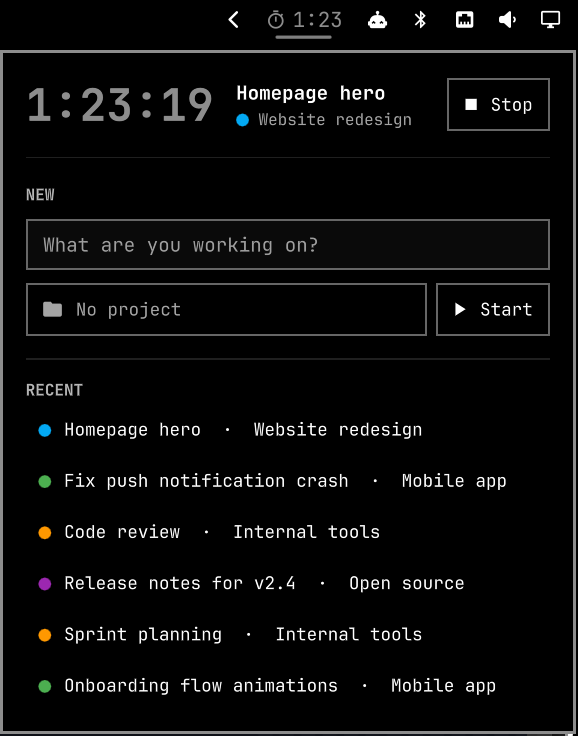

# omarchy-clockify

A minimal [Clockify](https://clockify.me) time tracker for the
[Omarchy](https://omarchy.org) bar. It shows the running timer in the bar and
opens a small popup with:

- **Current**: what's running, for how long, and Edit and Stop buttons. Click
  the project name to open that project on clockify.me.
- **New**: a description and an optional project. Press Enter to start.
- **Recent**: your last few distinct entries. Click one to restart it.
- **History** (button next to New): every entry from the last 7 days, grouped
  by day with daily totals. Click one to edit it, press its play button to
  continue it, or its trash button twice to delete it.
- **Editor**: change an entry's description (multi-line), project, and start
  and end times, or delete it.

That's the whole app. It's a native Omarchy shell plugin, so it follows your
theme and fonts. It keeps no daemon running and has no dependencies beyond
Python's standard library.



## Install

You need Omarchy with the Quickshell-based `omarchy-shell` and its plugin
system (`omarchy plugin add`). Tested on Omarchy 4.0. Python 3 ships with
Omarchy.

```bash
omarchy plugin add https://github.com/dpsk/omarchy-clockify.git --enable
```

Then click the timer icon in the bar and choose **Set up API key**. Or run the
setup directly:

```bash
python3 ~/.config/omarchy/plugins/dpsk.clockify/clockify.py setup
```

Setup asks for an API key (create one under Clockify → **Profile settings →
Manage API keys**), checks it against Clockify, lets you pick a workspace if you have more
than one, and saves it to `~/.config/omarchy/clockify.json` with mode `600`.

### Hotkey

Plugins can't register keybindings themselves. To open the panel with
<kbd>Super</kbd>+<kbd>Shift</kbd>+<kbd>T</kbd>, add this to
`~/.config/hypr/bindings.lua`:

```lua
o.bind("SUPER + SHIFT + T", "Clockify", "omarchy-shell dpsk.clockify toggle")
```

The same works for opening History or editing the running entry directly,
with `omarchy-shell dpsk.clockify history` or `... edit`.

## Usage

| Where | Input | Action |
|---|---|---|
| Bar icon | Left click | Open or close the panel |
| Bar icon | Middle click | Stop the running timer |
| Description field | <kbd>Enter</kbd> | Start the timer (or restart the highlighted recent entry) |
| Description field | <kbd>↑</kbd> / <kbd>↓</kbd> | Highlight a recent entry |
| Description field | <kbd>Tab</kbd> | Open the project picker |
| Project picker | Type, <kbd>↑</kbd>/<kbd>↓</kbd>, <kbd>Enter</kbd> or <kbd>Tab</kbd> | Filter and choose a project |
| Project picker | <kbd>Esc</kbd> | Close the picker |
| Main view | <kbd>Ctrl</kbd>+<kbd>E</kbd> | Edit the highlighted Recent entry, or the running one |
| Main view, History | <kbd>Ctrl</kbd>+<kbd>H</kbd> | Open or close History |
| Project button | Right click | Clear the selected project |
| Recent entry | Pencil or right click | Edit that entry |
| Current project name | Click | Open the project on clockify.me in a web-app window |
| History | <kbd>↑</kbd>/<kbd>↓</kbd>, <kbd>Enter</kbd> | Pick an entry and edit it |
| History | <kbd>s</kbd> | Continue the highlighted entry (start a new timer like it) |
| History | Trash icon or <kbd>x</kbd>, twice | Delete the highlighted entry (the first press asks for a few seconds, the second deletes) |
| Editor description | <kbd>Enter</kbd> / <kbd>Shift</kbd>+<kbd>Enter</kbd> | Save / start a new line |
| Editor | <kbd>Tab</kbd> | Next field: project, start, end |
| Editor | <kbd>Esc</kbd> | Cancel |
| Editor | Delete, then Really delete? | Delete the entry (past entries only) |
| Panel | <kbd>Esc</kbd> | Close the panel, or go back from History or the editor (in History it first cancels a pending delete) |
| Panel (no field focused) | <kbd>r</kbd> | Refresh from Clockify |

Times in the editor are typed as `9:30`, `0930` or `9.30` and apply to the
entry's own day. Clockify's update replaces the whole entry, so the helper
re-reads it and sends back what the panel doesn't show (tags, task, billable
status, custom fields) alongside your change. A task is dropped when you move
the entry to another project, since tasks belong to their project. Multi-line descriptions show
their first line (with `…`) in the bar tooltip, Current, Recent and History.

IPC:

```bash
omarchy-shell dpsk.clockify toggle    # also: open, close, show, hide
omarchy-shell dpsk.clockify stop
omarchy-shell dpsk.clockify start "Standup" <projectId>   # projectId may be ""
omarchy-shell dpsk.clockify refresh
omarchy-shell dpsk.clockify history   # open the panel on History
omarchy-shell dpsk.clockify edit      # open the editor for the running entry ("idle" if none)
# neither leaves an editor that is already open (they answer "editing")
omarchy-shell dpsk.clockify status    # "1:23 Writing docs  ·  Project" or "idle"
```

The helper also works as a standalone CLI. It prints JSON:

```bash
clockify.py status [--light]
clockify.py cached            # last snapshot from disk, no network
clockify.py start "Writing docs" [projectId]
clockify.py start --stdin     # reads {"description", "projectId"} as one JSON line
clockify.py stop
clockify.py update --stdin    # reads {"id", and any of "description", "projectId", "start", "end"}
clockify.py delete --stdin    # reads {"id"}
```

If your workspace requires a project or a description, the panel follows
those rules: Start stays disabled until the required field is filled in, and
an edit can't remove the required field.
Clockify would accept such an entry at start, but it would then refuse to stop
it.

## Settings

| Setting | Where | Default |
|---|---|---|
| `refreshIntervalSec` | the widget's entry in `~/.config/omarchy/shell.json` | `30` |
| `workspaceId` | `~/.config/omarchy/clockify.json` | your active workspace |
| `region` | `~/.config/omarchy/clockify.json` | `global` (`eu`, `us`, `uk`, `au` for regional data residency) |

```bash
omarchy bar set dpsk.clockify refreshIntervalSec 60 --json
```

## Resource use

- **Opening is instant.** The popup draws whatever is already in memory and
  never waits on the network. At startup, the last snapshot is read from disk
  (tens of milliseconds), so Recent and projects are ready even right after login.
- **Refreshing happens in the background.** While the popup is closed, the bar
  makes one small request every `refreshIntervalSec` through a short-lived
  Python process that exits right away. A full refresh (recent entries,
  projects, workspace rules) runs only when something changed: a timer was
  started or stopped here or on another device, or the data is more than a
  minute old when you open the popup. Its requests (including the last 7 days
  of history, up to 100 entries) go out in parallel, so it
  costs about one round trip to Clockify.
- After errors, polling backs off up to 5 minutes.
- The bar label updates once a minute, and only while a timer is running.
- The popup's contents are created when it opens and destroyed when it closes.

## What this plugin can access

- **Network**: only Clockify's API hosts (`api.clockify.me` or the regional host you choose).
- **Files**: reads `~/.config/omarchy/clockify.json` (`setup` writes it), and reads and writes `~/.cache/omarchy-clockify/` (your recent entries, last 7 days of history and projects, so the popup opens instantly).
- **Programs**: clicking the project name runs `omarchy-launch-webapp` to open
  that project on `app.clockify.me`. Like every Omarchy web app, this needs a
  Chromium-based browser (Chrome, Chromium, Brave, Edge, Vivaldi). Nothing
  else is executed apart from the helper itself.
- **Your Clockify account**: whatever your API key allows. The plugin only
  reads your user, workspaces, projects, and your own time entries, and only
  creates, stops, edits or deletes your own time entries. Before an edit or
  delete it re-reads the entry and refuses it unless the entry belongs to you,
  in the configured workspace, and isn't locked.

The API key never enters the shared QML scene, never shows up on a command
line, and is never printed. Entry descriptions reach the helper over stdin
(as do edits and deletes) rather than its command line, so other local users can't read them from
`/proc`. See [SECURITY.md](SECURITY.md) for the full
threat model.

## Development

Work directly in the installed checkout. The shell watches
`~/.config/omarchy/plugins/` for changes, but its watcher doesn't follow
symlinks, so a symlinked copy won't hot-reload.

```bash
cd ~/.config/omarchy/plugins/dpsk.clockify   # after `omarchy plugin add`
python3 -m unittest discover tests
omarchy plugin validate .
```

Saved QML changes reload automatically. `omarchy restart shell` forces it if
needed. The Python helper runs fresh on every call, so its changes apply
immediately.

## License

MIT

Not affiliated with, endorsed by, or supported by Clockify or CAKE.com.
"Clockify" is a trademark of its owner and is used here only to describe the
service this plugin connects to.
